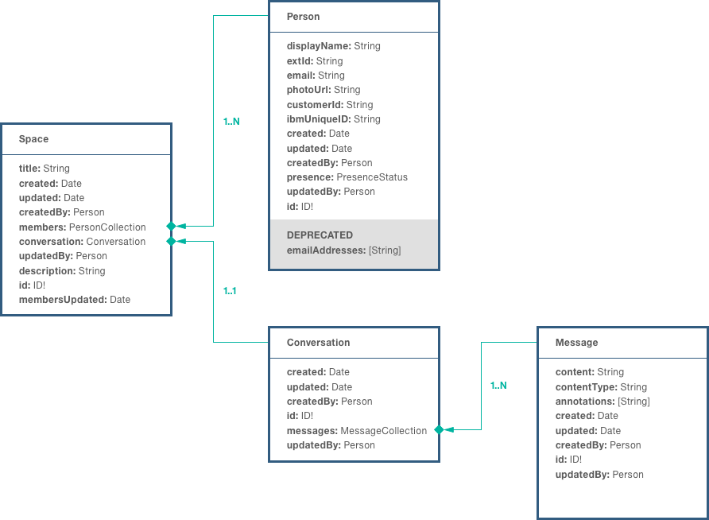
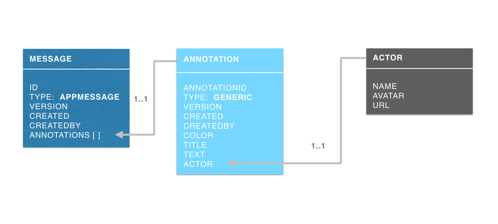
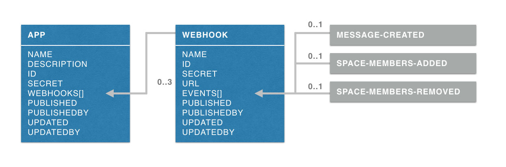

## Watson Work Services object model

The following images depict the Watson Work Services object model. Refer to our guide for a complete explanation of each object.
- [Space](./guides/V1_spaces_main.md)
- [Person](./guides/V1_people_main.md)
- [Conversation](./guides/V1_conversation_main.md)
- [Message](./guides/V1_message_main.md)

Annotations can be added to messages by apps or by processes internal to Watson Work Services. [Check out this guide](guides/V1_annotations.md) to learn more about annotations and actors.

## Watson Work Services App Model

