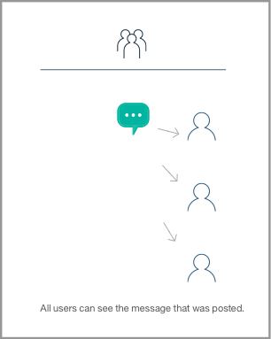
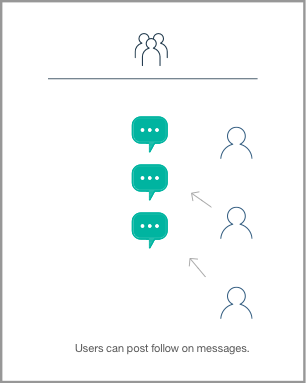
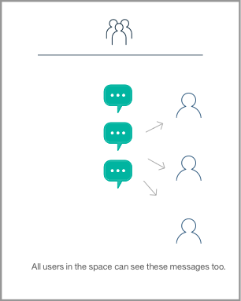
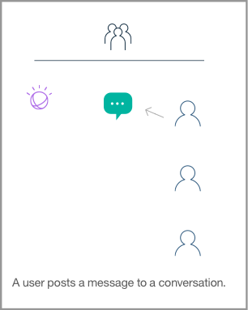
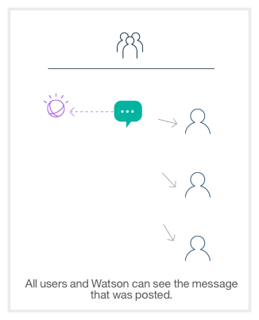
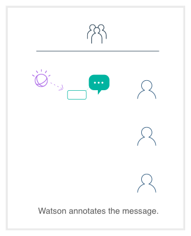
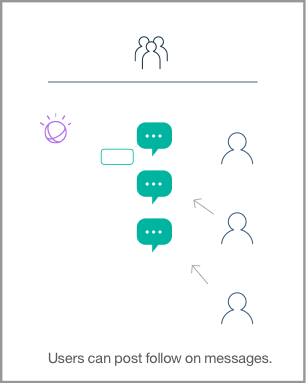
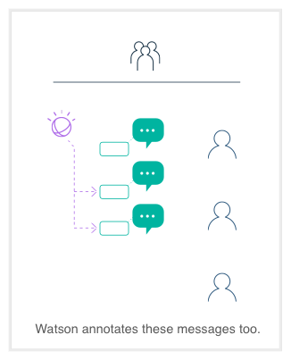

## Here's how it works

Basic Collaboration Flow.

If you want to see how things work here, let's start with the basics. In this series, you can see that, like any collaboration service, people can share messages through a conversation.

How Watson contributes

In Watson Work Services there's a whole lot more going on. Watson analyzes the content and will generate it's analysis, and share it by making use of the concept of Annotations. Annotations are meta information that is appended to things like messages in a conversation. You can learn about the details by [clicking here](guides/V1_annotations.md)

How Watson understands the conversation

