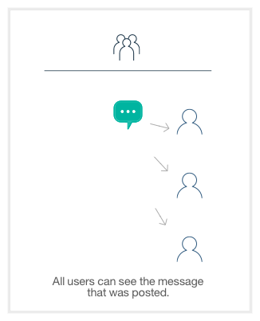
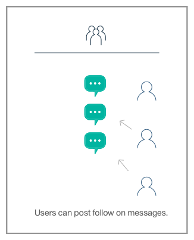
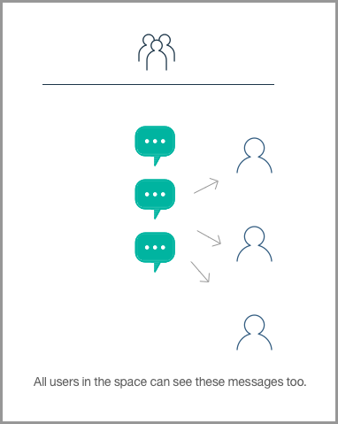

## Here's how it works

Basic Collaboration Flow.

If you want to see how things work here, let's start with the basics. In this series, you can see that, like any collaboration service, people can share messages through a conversation.

How Watson contributes

How Watson understands the conversation

