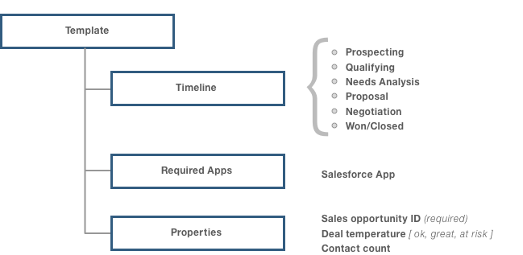
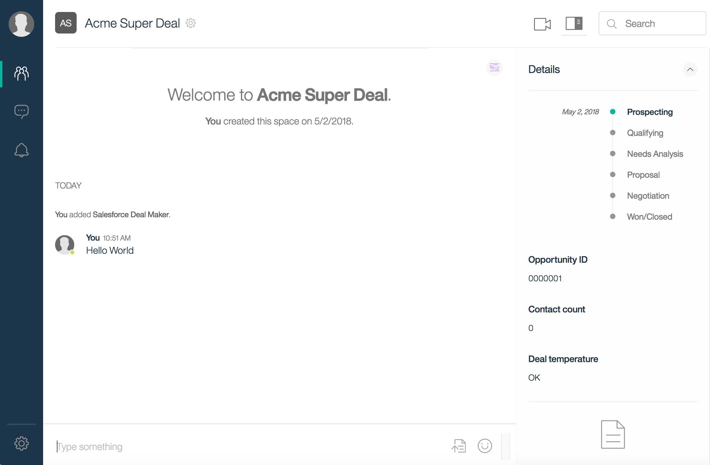
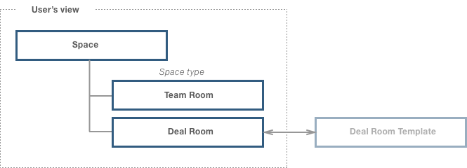

## Templates - Creating solutions

Watson Work Services introduce several ingredients that can be combined with other ones to create a particular "solution" to challenges faced by users when executing business processes.

Solutions in this context consist of a group of people interacting with each other, aided by external data as well as information assistants and generating data and events that form a context part of a specific business process.

Watson Work Services are utilized by Watson Workspace to provide a "default solution" experience around the concept of a space providing a context and a related conversation to a group of users.  The means to adjust and add to this experience to create a repeatable pattern of work that best adapts to the needs of the users is what this section will focus on.

These means include the ability to have a predefined "template" to be utilized for the presentation of specific type of spaces  that end users can use to instantiate a space from.  These "space types" typically represent an activity for the associated users to complete and thus include a set of "states" that the specific space transitions along a timeline.  Additional properties representing either derived output or information to be communicated can be defined along with logic in the form of associated apps.

## Let’s look at an example

Consider a sales team, and specifically sales opportunities. This follows a pattern;

- A seller or team of sellers has to work with a client and get their deals to closure
- They need to manage the deal, and get pricing to work for the situation
- They need to coordinate, usually on the fly to put together an offer
- They need to manage client meetings
- Assemble materials, information, presentations
- Bring on SME’s to help with the deal
- Turn around questions, issues and obstacles quickly to keep the deal moving
- Track the state of affairs on the deal, for themselves and for their management to keep a pulse on all the deals being worked

There’s a lot of coordination, creating and finding of artifacts, setting status updates on the sales deal itself, getting accurate sales information to inform the deal and a lot of collaboration via conversation to get all this done

Imagine creating a space for this kind of user, where they can interact and coordinate and have all the necessary tools to put everything together to make the deal happen - and by removing all the context changes these people have to go through, they have more time to focus on the things they deliver to close the deal.

## Delivering the solution

Making this concrete, from our example we will create spaces, called **Deal Rooms** (that’s the type of space).

A **Deal Room** has a **timeline**, that tracks the state of the deal. The **timeline** is;

- Prospecting
- Qualifying
- Needs Analysis
- Proposal
- Negotiation
- Won/Closed

And it indicates where the opportunity is, helps folks who are trying to gauge near term and long term pipeline of sales. Also, the team wants to make sure the deal stays on track, and if it gets derailed, they want to let everyone know, so they keep a **Deal Temperature** - when it goes HOT (at risk) they need to step it up.



And keeping track of a simple rule of thumb, the number of times they make contact with the client around this deal, is a good metric to make everyone aware of.

A Deal Room needs to connect with the system of record for the Opportunity, to log meetings, collect contacts, and deal with other elements of the sales deal. A popular service many sales folks use is SalesForce. A Deal Room would need an App that connects to Salesforce. That App can let folks the Deal Room deal with making and seeing changes in the Salesforce Opportunity, the Salesforce App is required for the space.

Now that we know what we want, we need to figure out how to build it with Watson Work Services. What do we have that we can use to create this?

In Watson Work Services, we have a concept that will allow a developer to assemble a space with apps and a timeline, called **Templates**.

A **Template** is a definition that represents an object and can be composed of a set of objects. When defined, a user can then create that object and have an instant the represents the definition.

In Work Services currently, we define a **Template** as;

- a type of space
- optionally contains a time line that represents the state of the space type
- optionally contains one or more properties
- optionally contains one or more required Apps


Also, as part of the behavior of the template (once it is instantiated), any change in the time line or property becomes part of the event model - so that an App can listen for those change events and take action.

## Design the template

Right now you can use our API and GraphQL tool to design and create your Template, (soon we’ll add this to the Developer Experience in Your Apps too!). You’ll need to build your own App and grab that App’s ID to use for required Apps…don’t use the id I have here, it’s bogus!

```GraphQL
mutation {
  createSpaceTemplate(input:
    {
      	name: "Deal Room",
      	description: "A space for deals.",
      	spaceStatus:
      	{
          	acceptableValues: [
              {displayName: "Prospecting"},
              {displayName: "Qualifying"},
              {displayName: "Needs Analysis"},
              {displayName: "Proposal"},
              {displayName: "Negotiation"},
              {displayName: "Won/Closed"}
            ]
        },
				properties:
      	{
          	properties: [
              {textProperty: {displayName: "Opportunity ID", defaultValue: "none"}},
              {textProperty: {displayName: "Contact count", defaultValue: "none"}},
 							{listProperty:
                {
                displayName: "Deal temperature"
          			acceptableValues:[
            			{displayName:"OK"},
            			{displayName:"Great"},
                  {displayName:"At risk"}
          			]
                }}  
            ]
        }
      requiredApps:
      {
        	apps:
            	{id: "36a3ca38-fa32-43df-b28e-2fef7141c56f"}
      }})
  	{
    spaceTemplate {
      id
      name
      description
      teamId
      created
      createdBy {
        displayName
      }
      offeringCollaborationType
      spaceStatus {
        acceptableValues {
          displayName
          id
        }
        defaultValue
      }
      properties {
        items {
          id
          type
          displayName
          ... on SpaceTextProperty {
            defaultValue
          }
          ... on SpaceBooleanProperty {
            defaultStringValue
          }
          ... on SpaceListProperty {
            defaultValue
            acceptableValues {
              id
              displayName
            }
          }
        }
      }
      requiredApps {
        items {
          id
        }
      }
    }
  }
}

```

Now, here’s the output for running this GraphQL mutation - which created the Template!


```GraphQL
{
  "data": {
    "createSpaceTemplate": {
      "spaceTemplate": {
        "id": "43101971-4d6e-11e8-9612-17ab710fbd53",
        "name": "Deal Room",
        "description": "A space for deals.",
        "teamId": null,
        "created": "2018-05-01T18:34:21.869+0000",
        "createdBy": {
          "displayName": "Joseph Russo"
        },
        "offeringCollaborationType": null,
        "spaceStatus": {
          "acceptableValues": [
            {
              "displayName": "Prospecting",
              "id": "1fee697c-49a2-42bf-be0a-a43721acc5c3"
            },
            {
              "displayName": "Qualifying",
              "id": "df5c4d66-2aaa-4608-a985-0e8bafe4f580"
            },
            {
              "displayName": "Needs Analysis",
              "id": "e5395ade-9e0b-40b3-8e79-3288de7f46e3"
            },
            {
              "displayName": "Proposal",
              "id": "48afb48a-4225-4287-94d1-8aa5c5c14c39"
            },
            {
              "displayName": "Negotiation",
              "id": "12800574-3560-4b25-ac82-3a78df04c102"
            },
            {
              "displayName": "Won/Closed",
              "id": "bb7f611b-7068-4da4-8bb5-cdec7fd3c868"
            }
          ],
          "defaultValue": "1fee697c-49a2-42bf-be0a-a43721acc5c3"
        },
        "properties": {
          "items": [
            {
              "id": "a3f5ad57-5c7a-4404-a308-9d8ad8571eb2",
              "type": "TEXT",
              "displayName": "Opportunity ID",
              "defaultValue": "none"
            },
            {
              "id": "45dd2253-1963-463d-af1d-c978162ed48a",
              "type": "TEXT",
              "displayName": "Contact count",
              "defaultValue": "none"
            },
            {
              "id": "97d417db-9198-437c-8f88-181ced2f8916",
              "type": "LIST",
              "displayName": "Deal temperature",
              "defaultValue": "88928a1e-05be-4e2a-9435-80b7122755c7",
              "acceptableValues": [
                {
                  "id": "88928a1e-05be-4e2a-9435-80b7122755c7",
                  "displayName": "OK"
                },
                {
                  "id": "56dfcae1-3726-4b89-af13-0959b9082345",
                  "displayName": "Great"
                },
                {
                  "id": "51e2dc37-ba37-459d-a576-37815aee6b0a",
                  "displayName": "At risk"
                }
              ]
            }
          ]
        },
        "requiredApps": {
          "items": [
            {
              "id": "36a3ca38-fa32-43df-b28e-2fef7141c56f"
            }
          ]
        }
      }
    }
  }
}

```

Once you’ve created your template - you have a the means to create spaces of this type. We need to use the mutation to create a space,  and include that we want Watson Work Services to use our definition , so we use the template ID (you can grab that from the create template results above). Also you need to make sure you set **all** property values.

``` GraphQL
mutation createSpace {
  createSpace(input: {
    title: "Acme Super Deal",  
    members: [""],
  	templateId : "43101971-4d6e-11e8-9612-17ab710fbd53",
    visibility : PRIVATE,
		propertyValues: [
      {
        propertyId: "a3f5ad57-5c7a-4404-a308-9d8ad8571eb2",
        propertyValueId: "0000001"
      },
    	{
        propertyId: "45dd2253-1963-463d-af1d-c978162ed48a",
        propertyValueId: "0"
      },
      {propertyId: "97d417db-9198-437c-8f88-181ced2f8916",
        propertyValueId: "88928a1e-05be-4e2a-9435-80b7122755c7"
      },
    ],} )
  {
      space {
      title
      templateInfo {
        id
        name
        description
        created
        createdBy {
          displayName
        }
        spaceStatus {
          acceptableValues {
            displayName
            id
          }
          defaultValue
        }
        properties {
          items {
            id
            type
            displayName
            ... on SpaceTextProperty {
              defaultValue
            }
            ... on SpaceBooleanProperty {
              defaultStringValue
            }
            ... on SpaceListProperty {
              defaultValue
              acceptableValues {
                id
                displayName
              }
            }
          }
        }
        requiredApps {
          items {
            id
          }
        }
      }
    }
  }
}

```


And when we run this mutation, we get this result, the space is created.

```GraphQL
{
  "data": {
    "createSpace": {
      "space": {
        "title": "Acme Super Deal",
        "templateInfo": {
          "id": "43101971-4d6e-11e8-9612-17ab710fbd53",
          "name": "Deal Room",
          "description": "A space for deals.",
          "created": "2018-05-01T18:34:21.869+0000",
          "createdBy": {
            "displayName": "Joseph Russo"
          },
          "spaceStatus": {
            "acceptableValues": [
              {
                "displayName": "Prospecting",
                "id": "1fee697c-49a2-42bf-be0a-a43721acc5c3"
              },
              {
                "displayName": "Qualifying",
                "id": "df5c4d66-2aaa-4608-a985-0e8bafe4f580"
              },
              {
                "displayName": "Needs Analysis",
                "id": "e5395ade-9e0b-40b3-8e79-3288de7f46e3"
              },
              {
                "displayName": "Proposal",
                "id": "48afb48a-4225-4287-94d1-8aa5c5c14c39"
              },
              {
                "displayName": "Negotiation",
                "id": "12800574-3560-4b25-ac82-3a78df04c102"
              },
              {
                "displayName": "Won/Closed",
                "id": "bb7f611b-7068-4da4-8bb5-cdec7fd3c868"
              }
            ],
            "defaultValue": "1fee697c-49a2-42bf-be0a-a43721acc5c3"
          },
          "properties": {
            "items": [
              {
                "id": "a3f5ad57-5c7a-4404-a308-9d8ad8571eb2",
                "type": "TEXT",
                "displayName": "Opportunity ID",
                "defaultValue": "none"
              },
              {
                "id": "45dd2253-1963-463d-af1d-c978162ed48a",
                "type": "TEXT",
                "displayName": "Contact count",
                "defaultValue": "none"
              },
              {
                "id": "97d417db-9198-437c-8f88-181ced2f8916",
                "type": "LIST",
                "displayName": "Deal temperature",
                "defaultValue": "88928a1e-05be-4e2a-9435-80b7122755c7",
                "acceptableValues": [
                  {
                    "id": "88928a1e-05be-4e2a-9435-80b7122755c7",
                    "displayName": "OK"
                  },
                  {
                    "id": "56dfcae1-3726-4b89-af13-0959b9082345",
                    "displayName": "Great"
                  },
                  {
                    "id": "51e2dc37-ba37-459d-a576-37815aee6b0a",
                    "displayName": "At risk"
                  }
                ]
              }
            ]
          },
          "requiredApps": {
            "items": [
              {
                "id": "36a3ca38-fa32-43df-b28e-2fef7141c56f"
              }
            ]
          }
        }
      }
    }
  }
}

```

And here it is



Now that you have created this template definition, you can allow others to use it to create spaces. Users will see this when they go to create a new space, they can select a space type, and choose Deal Room.



When a user decides to create a new space of type Deal Room they will;

- Give it a name and description
- Since it’s required they must enter a sales opportunity id (from their sales dashboard)
- Finish this flow to create the space.

Once the space is created, the Salesforce App is automatically added to this space. Also the time line is shown in the user experience so all the space members can see and update the timeline in the deal room.

That's the story for creating solutions with Watson Work Services.

Dive into the details here:

- [Create a space template](./V1_create_space_template.md)
- [Space template](./V1_space_template_main.md)
- [Space template info](./V1_space_template_info.md)
- [Get my space templates](./V1_get_my_space_templates.md)
- [Get offering space templates](./V1_get_offering_space_templates.md)
- [Get team templates](./V1_get_team_space_templates.md) `EXPERIMENTAL`
- [Get space template](./V1_get_space_template.md)
- [Create a space from a template](./V1_create_space_from_template.md)
- [Delete space template](./V1_delete_space_template.md)
- [Share space template](./V1_share_space_template.md) `EXPERIMENTAL`


