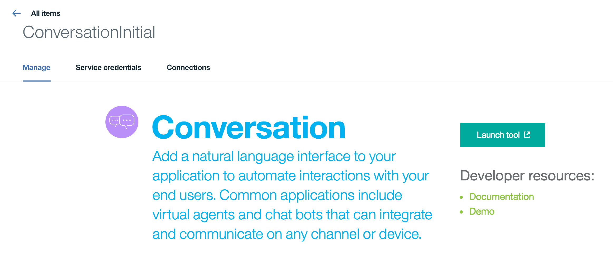
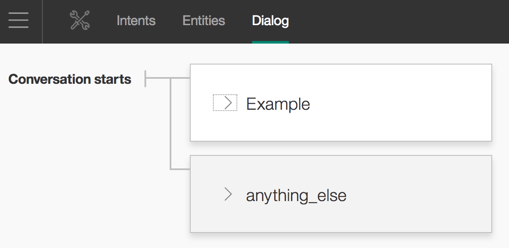
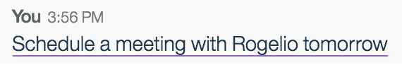
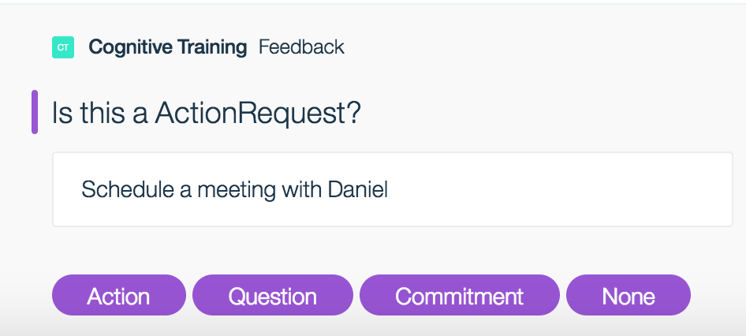
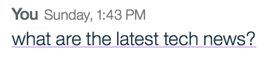
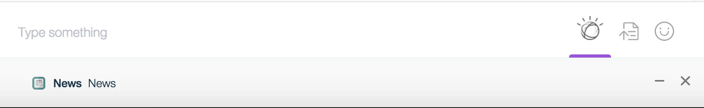
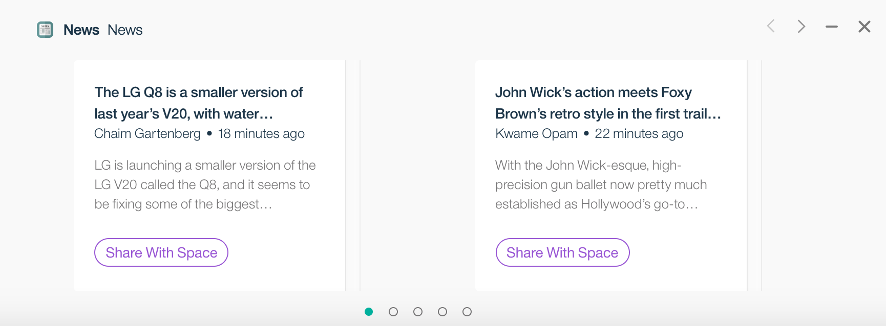

# Action Fulfillment

## Concepts

Action fulfillment enables developers to create apps that can define actions on a particular phrase, and privately interact with the end users once they've selected the action.

Apps can achieve this functionality by implementing these tasks:

1. Specifying possible actions on some aspect of the conversation, for instance, a part of a message. This is done by integrating your app with an instance of Watson Conversation which has defined actions, or by directly calling the Watson Work Service APIs to declare an action has been identified.
2. Presenting the user with steps to fulfill the action, represented as messages from your app sent to the user. This is done through the Watson Work Services APIs for creating messages.
3. Receiving a user's responses to the steps. This is done by receiving calls from Watson Work Services, via Webhooks.

Interacting with the user takes place in isolation of the other participants in the conversation. This prevents disturbing the flow of the conversation. Apps can send messages to private dialogs with the user and listen to actions taken by the user through Webhooks. Watson Work Services routes the messages to the appropriate device where the user is performing the action.

## Making your App Cognitive

### Create your App

* Follow the instructions for creating your app with the [Prepare your App to Run](https://developer.watsonwork.ibm.com/docs#prepare-your-app-to-run) instructions.
* When configuring the webhook select to receive `message-annotation-added` events.
* Configure a Watson Conversation through Bluemix following the steps below.

### Configuring a Watson Conversation Instance

Your Watson Conversation instance can be setup to utilize Dialog, a Conversation feature, which allows you to model conversations using nodes, or potential states. The conversation node must be configured with a name, a trigger and a response. This describes which messages should surface to the user as a triggerable action.

**Adding a Watson Conversation Node**

Go to Bluemix and go to your Watson Conversation Service. Launch the tool and select the
Workspace your app is connected to.



In your Watson Conversation instance, navigate to the Dialog tab



Where it says `Conversation starts`, you want to add a new conversation node. A form
will appear and this dictates how your application uses your intents.

**Configuring a Watson Conversation node, triggers and responses**

_Node Name_

Name of the node.

_Triggers_

The `TRIGGERS` tell Watson Conversation which intents, entities, and/or context variables this conversation node should act upon. A good idea is to fill it
with any of the intents that you want your application to recognize. In the IF statement's `Enter a condition`, enter in any intents like this: `#INTENT_NAME` These should match data in your `Intents` tab. You can also have chain multiple
intents to the same trigger.

_Responses_

For the `Responses` section, you want to enable the advanced view by clicking on the
`{...}`. This section tells Watson how to respond if it recognizes one of your triggers.
In order for Watson Workspace to recognize your action, the response output will need
to have an actions array with the name of an action that you can choose.

```javascript
{
  "output": {
    "actions": [
      "ACTION_NAME"
    ]
  }
}
```

This will allow users of IBM Watson Workspace to click on messages that your app recognizes.

**Make it Cognitive**
In the 'Make it Cognitive' section of your app you can provide the identifier for your Watson Conversation Workspace that is configured in a Watson Conversation Instance. You will also need the Watson Conversation Username/Password from Bluemix.

## APIs to support Action Fulfillment

**Action Selected annotation**

Request body sample:

```
{
  spaceName: 'Sample Space Name',
  annotationType: 'actionSelected',
  annotationPayload: '<PAYLOAD_BELOW>',
  messageId: '58934f00e4b0f86a34bbd073',
  spaceId: '58934f00e4b0f86a34bbd085',
  userName: 'Sample End User',
  type: 'message-annotation-added',
  userId: '83152e37-0d9f-4bbb-9d5f-024e75a97600'
}
```

annotationPayload is a string that needs to be parsed. Below are the parsed contents:

```
{
  type:'actionSelected',
  annotationId: '',
  version:'1.0',
  created: '',
  createdBy: '',
  updated: '',
  updatedBy: '',
  tokenClientId: '',
  conversationId:'58934f00e4b0f86a34bbd085',
  targetDialogId:'SAMPLE_ACTION_1234',
  referralMessageId:'590758dce4b0a1b856e3169e',
  actionId: 'SAMPLE_ACTION',
  targetAppId:'83152e37-0d9f-4bbb-9d5f-024e75a97713'
}
```

* `conversationId` is the id of the space that the action is within
* `referralMessageId` is the id of the message that the user acted upon
* `actionId` is the id of the button that was acted upon
* `targetAppId` is the appId that the triggered action belongs to.
* `targetDialogId` is a string indicating the particular private dialog instance

**Create Targeted Message**
~~~~
Method: POST
URL: https://api.watsonwork.ibm.com/graphql
Headers: 'Content-Type: application/graphql' , 'x-graphql-view: PUBLIC, BETA'
~~~~

```
  mutation {
    createTargetedMessage(input: {
      conversationId: "58934f00e4b0f86a34bbd085"
      targetUserId: "83152e37-0d9f-4bbb-9d5f-024e75a97600"
      targetDialogId: "SAMPLE_ACTION_1234"
      annotations: [],
      attachments: []
      }) {
      successful
    }
  }
```

The `targetDialogId` and the `targetUserId` are obtained from the actionSelected webhook event received by the app. These are sent back in the createTargetedMessage graphql call so that they display for that user and in the correct dialog. The annotations should be an array of generic annotations with buttons property.

The generic annotation can be added through GraphQL for these targeted messages. In addition to the title and text field, generic annotations within a targeted message can contain buttons with a title, id and style. The title is the text that is displayed to the user. The button identifier (id) is used as the actionId of a Webhook event that is sent back to your app. The current styles are _PRIMARY_ (purple button) AND _SECONDARY_ (gray button).

Here's an example with a generic annotation:

```
  mutation {
    createTargetedMessage(input: {
      conversationId: "58934f00e4b0f86a34bbd085"
      targetUserId: "83152e37-0d9f-4bbb-9d5f-024e75a97600"
      targetDialogId: "SAMPLE_ACTION_1234"
      annotations: [
      {
        genericAnnotation: {
          title: "Sample Title",
          text: "Sample Body"
          buttons: [
            {
              postbackButton: {
                title: "Sample Button",
                id: "Sample_Button",
                style: PRIMARY
              }
            }
          ]
        }
      }
      ]
      }) {
      successful
    }
  }
```

Attachments can be added through GraphQL for targeted messages as well. If your app sends both attachments and annotations, only attachments will be rendered in the User Experience. Cards are a type of an Attachment. Information card is a type of Card Attachment. Information card has title, subtitle, text, date, and can also contain buttons. The title is the primary text that is displayed in card. The subtitle is secondary text in the card. The date is a unix-timestamp displayed as human readable date in the card. Buttons have text, payload, and style. The button payload is used as the actionId of a Webhook event that is sent back to your app. The current styles are _PRIMARY_ (purple button) AND _SECONDARY_ (gray button).

Here's an example with attachments:

```
  mutation {
    createTargetedMessage(input: {
      conversationId: "58934f00e4b0f86a34bbd085"
      targetUserId: "83152e37-0d9f-4bbb-9d5f-024e75a97600"
      targetDialogId: "SAMPLE_ACTION_1234"
      attachments: [
      {
          type: CARD,
          cardInput: {
              type: INFORMATION,
              informationCardInput: {
                  title: "Sample Title",
                  subtitle: "Sample Subtitle",
                  text: "Sample Text",
                  date: "1500573338000",
                  buttons: [
                      {
                          text: "Sample Button Text",
                          payload: "Sample Button Payload",
                          style: PRIMARY
                      }
                  ]
              }
          }
      }
      ]
      }) {
      successful
    }
  }
```

**Interacting with users through action fulfillment**

If your Watson Conversation instance recognizes one of your intents that has been configured with an action, a `message-focus` annotation will be added to the message. This annotation will contain information about the actions that have been configured, enabling the Workspace clients to indicate to the end user that an action can be taken. If the end user selects the action, an event will be sent to your Webhook in the form of a `message-annotation-added` event.

To interact with the end user who has selected the action:

1. In the request body check that the type is `message-annotation-added` and that the annotationType is `actionSelected`.
2. The `actionId` from the annotationPayload is the name of the action from Watson Conversation defined earlier in the  _Response_ section.
3. Create a `targeted message` containing the `Generic Annotation` directed towards the user

  * `conversationId` can be found from the original request body
  * `targetUserId` is the `userId` found from request body
  * `targetDialogId` can be found from annotationPayload in request body

The message will be displayed to the user in a dialog box at the bottom of the chat transcript showing the title, text and/or buttons that the message directed to show.

## Seeing it in Action via Watson Workspace

An example of triggerable actions within the Watson Workspace platform. Text that you type in a space can be annotated and allow your app to add additional content.

### Targeted Message with Annotation



When a user selects the highlighted action, then a private dialog will surface under the text input area:



If the user can click on buttons in the message sent to the dialog box, the process of communication to the app and back to the dialog can continue to happen until the app developer chooses to end the communication. A Share button for example could end the interaction with the user sharing a piece of information with the whole space.

### Targeted Message with Attachments




When a user selects the highlighted action, then a private dialog will surface under the text input area:



Click on the private dialog will trigger the private flow with the app. The app can send a targeted message with attachments. Cards in Web client will be rendered as:



If the user can click on buttons in the message sent in the information card, the process of communication to the app and back to the dialog can continue to happen until the app developer chooses to end the communication. A Share button for example could end the interaction with the user sharing a piece of information with the whole space.


## Sample Applications
We have created a few different sample applications that demonstrate action fulfillment scenarios which you can get running yourself in Bluemix. Feel free to provide us with pull requests and/or issues!

* [Brewerydb App](https://github.com/watsonwork/watsonwork-brewerydb-java) - A sample Watson enabled cognitive app that integrates with http://www.brewerydb.com APIs to bring back brewery information by city to illustrate action fulfillment flows.
* [Ticketmaster App](https://github.com/watsonwork/watsonwork-ticketmaster) - A sample Watson enabled cognitive app that integrates with the Ticketmaster APIs to bring back events in a city based on dates to illustrate action fulfillment flows.

Action Fulfillment is currently in BETA release and will continue to undergo development.
