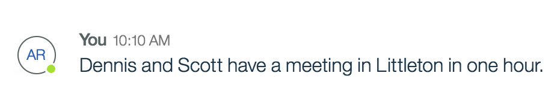
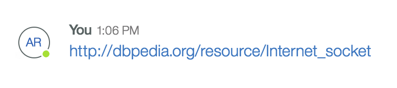

## Information Extraction Annotations

Now that you are familiar with [Annotations](../guides/V1_annotations.md) let's dig deeper and take a look at what sort of information can be extracted from a Message's Annotation list.

For each message, the entire text gets processed using [Alchemy Language services](https://www.ibm.com/watson/developercloud/alchemy-language.html): **entities**, **keywords**, **doc-sentiment**, **concepts**, and **taxonomy**. Annotations are created if the results are not empty.

See [Annotation](../guides/V1_annotations.md) if you need a refresher on the common annotation fields.

### Entities
Messages are processed to identify `entities` within the text. Entities are simply people, places or organizations. Identifying `entities` provides insight into the subject content.

Let's imagine you sent the following message.



Here is the resulting `entities` annotation structure.

````json
{
	"type" : "message-nlp-entities",
	"annotationId": "580dac04e4b08f1c50fb66e8",
	"created": 1477291012240,
	"createdBy": "toscana-aip-nlc-consumer-client-id",
	"language": "english",
	"entities": [
		{
			"count": 1,
			"relevance": 0.33,
			"text": "Dennis",
			"type": "Person"
		},
		{
			"count": 1,
			"relevance": 0.33,
			"text": "Scott",
			"type": "Person"
		},
		{
			"count": 1,
			"relevance": 0.33,
			"text": "Littleton",
			"type": "City"
		},
		{
			"count": 1,
			"relevance": 0.33,
			"text": "one hour",
			"type": "Quantity"
		}
	]
}
````

### Keywords
`Keywords` are identified within a message and often can overlap with `entity` identification. They are particularly useful when searching content or indexing. When `keywords` are found, their relevance in the content is also identified.

Using the same example message, let's look at the `keyword` annotation structure.

````json
{
	"type": "message-nlp-keywords",
	"annotationId": "580dac04e4b08f1c50fb66e7",
	"created": 1477291012240,
	"createdBy": "toscana-aip-nlc-consumer-client-id",
	"language": "english",
	"keywords": [
		{
			"relevance": 0.91067,
			"text": "Littleton"
		},
		{
			"relevance": 0.843401,
			"text": "Dennis"
		},
		{
			"relevance": 0.690754,
			"text": "meeting"
		},
		{
			"relevance": 0.684183,
			"text": "Scott"
		}
	]
}
````

### Sentiment
Each message is analyzed for sentiment, which can be a opinion or sentiment for an entity or something else within the message.

Here is the annotation structure for `doc-sentiment`.
````json
{
	"type": "message-nlp-docSentiment",				   
	"annotationId": "58416d89e4b092a88ef3639c",
	"created": 1480682889871,
	"createdBy": "toscana-aip-nlc-consumer-client-id",
	"tokenClientId": "toscana-aip-nlc-consumer-client-id",
	"language": "english",
	"docSentiment": {
		"score":0.717351,
		"type":"positive"
	}
}
````

### Concepts
`Concepts` are similar to keywords and entities but goes a bit deeper. `Concepts` identify the relationship between the entities, keywords and other `concepts`. As an example suppose this link is part of the conversation.



Looking at the `concepts` annotation structure, notice how the text "Internet socket" is derived without it explicitly being stated.
````json
{
	"type": "message-nlp-concepts",
	"annotationId": "583eef8fe4b02dec81c24927",
	"created": 1480519567764,
	"createdBy": "toscana-aip-nlc-consumer-client-id",
	"tokenClientId": "toscana-aip-nlc-consumer-client-id",
	"language": "english",
	"concepts": [
		{
			"dbpedia": "http://dbpedia.org/resource/Internet_socket",
			"relevance": 0.886784,
			"text": "Internet socket"
		}
	]
}

````

### Taxonomy
`Taxonomy` is just a fancy way of describing the categorizing process. Where possible a `taxonomy` extraction is provided where one or more taxonomies are associated with the message or message part.

Here is a sample annotation structure that contains a `taxonomy` example.
````json
{
	"type": "message-nlp-taxonomy",
	"annotationId": "583eef9ae4b09975a08f5865",
	"created": 1480519578346,
	"createdBy": "toscana-aip-nlc-consumer-client-id",
	"tokenClientId": "toscana-aip-nlc-consumer-client-id",
	"language": "english",
	"taxonomy": [
		{
			"confident": false,
			"label": "/technology and computing/consumer electronics/telephones/mobile phones",
			"score": 0.725152
		},
		{
			"confident": false,
			"label": "/technology and computing/hardware/computer networking/router",
			"score": 0.197325
		},
		{
			"confident": false,
			"label": "/technology and computing/mp3 and midi",
			"score": 0.165545
		}
	]
}
````
