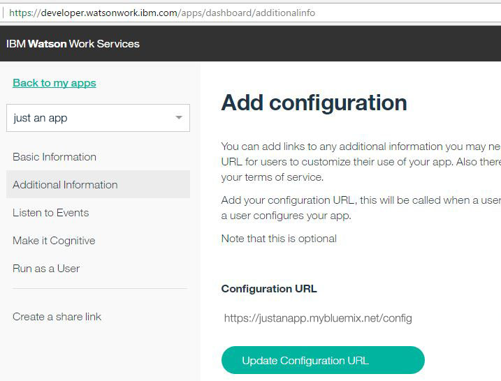

# Make your App configurable

User-specific configurations can benefit your App in many ways. For example, a scheduling app might need calendar access. Having the user's authorization or credentials is essential for coordinating with third-party services.  

Recognizing user-specific preferences can also enhance your App.  For example, the scheduling app can propose better meeting times when user has already entered their preferred times.

You can even consider customizing your app differently for each space it's been added to.   

A configuration can take place at two times:
 - when your App is added to a space
 - when a member of a space configures your App in that space

If your App registers a configuration, then users adding it to a space will see a Configure button.

NOTE: All members of a space have access to configure an app in the space regardless of who added the app to the space.

## Implementing the configuration page

First, you need to implement your configuration page for your App. Read the [Configuration Callback API](../guides/V1_App_Configuration_Callback.md) for more information.

## Registering the configuration URL of your app

Next, register the configuration URL of your App in the App Dashboard.  
1. Go to Your Apps and choose an App
2.  Click Additional Information
3.  Click Add Configuration URL
4.  Add the Configuration URL and click Add

## Steps to configure your app

It's important to think about these things when making your App configurable.
 - The configuration page can be requested by anyone, so the caller and the provided parameters must be verified.

 - If your app is configurable per user and you want to show the user's name, then you must obtain the user id and name also to establish a link between the user's ID and the user's name.

 - If your app is configurable per space, then you should display the space name to help the caller verify that it is indeed the space for which the configuration should take place.

 - You should display a continue to space button to complete the process of adding the app to a space.

 Let's walk through these.

### Protect the configuration endpoint

Making an endpoint publicly available has security risks; for example, your configuration endpoint could receive requests from malicious sources. To minimize risk:
- Be prepared for <a href="https://en.wikipedia.org/wiki/Network_security#Types_of_Attacks" target="_blank">network attacks</a> and ensure that appropriate counter-measures are in place.
- Do not assume that the request or its parameters are trustworthy until you have verified the call.

### Verify the call

Use url parameter `configurationToken` and utilize Watson Work Services to verify the call.
Authorize your app [as an App](../references/V1_oauth_token_client_credentials.yml) and access the configuration data with the `configurationToken` - see [Access configuration data](./docs#access-configuration-data).
If the access to the configuration data is successful, then you can be sure that the call has been triggered by Watson Workspace.
You will also get the configuration data, which includes `spaceId` and `userId`.  `spaceId` is the unique ID of the space for which the configuration of your app has been triggered.  `userId` is the unique ID of the user who triggers the configuration of your app.

- Note: If the implementation of the your configuration page still base on version prior to 1.1.0 of the [Configuration Callback API](../guides/V1_App_Configuration_Callback.md), then you have to do the oauth flow to verify the caller as a user of Watson Work Services, to obtain the user id and name, and to establish a link between the user's ID and the user's name.

### Protect the user's sensitive data

You can utilize Watson Work Services to authorize the user as a valid Watson Work Services user by [getting the user details](./docs#get-the-user-id-and-name) and / or you can also authorize the user against your own credential store of users authorized to use your app.

### Authorizing the app

Your app must be authorized to request services from Watson Work Services. There are two ways to authorize an app; both require the App ID and App Secret:
- [as an App](../references/V1_oauth_token_client_credentials.yml) can retrieve details from the app perspective (for example, the names of spaces that the app was added to)
- [on behalf of a User](./docs#access-details-on-behalf-of-a-user) can retrieve details from the user perspective (for example, the names of spaces that the user is a member of)

### Get the user ID and name

If your app is configurable per user, then you must verify the user's identity before showing, or allowing updates to, the user's sensitive data. Verify the user with Watson Work Services by requesting the [user entity](./docs#get-my-user-information) on [behalf of the user](./docs#access-details-on-behalf-of-a-user). The resulting object contains the user ID in its `id` field and the user name in its `displayName` field.

### Access details on behalf of a user

If your app is going to make requests to Watson Work Services on behalf of a user, you must follow the standard OAuth flow for running on behalf of a user. First you will need to call the [Authorization Endpoint](../references/V1_oauth_authorize_code.yml) to authenticate the user. Then call the [Authorization Code Grant](../references/V1_oauth_token_code.yml), which will return the JWT Token for your app to act on behalf of the user.

### Get the space name

If your app is configurable per space, then it is good practice to ensure that the user is aware of which space the app is being configured for.  To get the space name, request the [Space Details](./docs#get-space-details) in Watson Work Services.  The resulting object contains the space name in its `title` field.

NOTE: You can only get information for spaces that you are authorized for. In particular, this means:
- The authorization [as an App](../references/V1_oauth_token_client_credentials.yml) can access information for spaces that the app was added to.
- The authorization [on behalf of a User](./docs#access-details-on-behalf-of-a-user) can access details of spaces that the user is a member of.

### Continue to the space

When the user is finished configuring your App for a space, it's a good idea to include an easy way to quickly return to that space. For example, if your App has been made to work with <a href="https://workspace.ibm.com/" target="_blank">Watson Workspace</a> you can do this by providing a link or button back to the space, using the URL pattern `https://workspace.ibm.com/<spaceId>/`.
