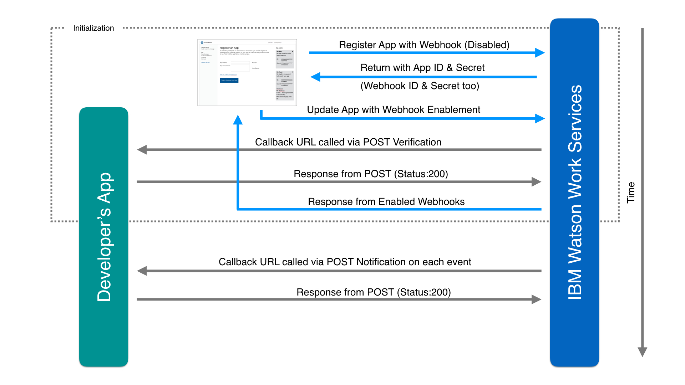

# Prepare your App to run

This guide will help you to prepare your code to work, once you have registered with Watson Work Services.
If you haven't registered yet, you can do so here, [Create your App](https://developer.watsonwork.ibm.com/apps).

## How Apps can run in Watson Work Services

In Watson Work Services we have defined two types of Entities that can interact.

First there are People, and the **Person Entity**, that can be authorized to act, to do things like create a space, post a message to a space, and so on. There is also the **App entity** which can be authorized to act in much the same way.

An App can post using its own identity as shown.


An app can also act on behalf of a user in Watson Work Services.  This means that your App would be a proxy for a user, and the app would interact with Watson Work Services as if it was the user.

For example, let's say you create an App that integrates a CRM tool with Watson Work Services and every time a user creates a new sales opportunity in the CRM tool, it gets posted into a space in Watson Workspace.  The message would show that a user initiated this action yet the message would have been posted via the app.

When an App entity is added to a space, it is authorized to act in the scope of the space - same as if a person was added to a space.  This means that apps which act as the App entity only have access to the spaces they've been added to (authorized for).

However, when an App entity is acting on behalf of a user, then the App Entity is a proxy, authorized to act in the scopes in which the user has authorization.  If the app has been designed to post messages to a space, and is authorized by the user, then it will be able to post to any space in which the user is authorized.  

## Calling Watson Work Services as an App Entity

If your app is going to make calls to Watson Work Services under its own identity, you will need to use your App ID and your App Secret to authenticate your App with Watson Work Services.  This will get you an access token in the form of a JWT token.

You have to pass the JWT token to Watson Work Services in order to make secure API calls.  To authenticate you will need to add a call to the Authentication API in your App (See [Authenticate as an application](../references/V1_oauth_token_client_credentials.yml)). You need to do this because the JWT token expires, but your App ID and Secret do not and once the token expires it's no longer valid and calls will fail.   

TIP:  Track the expiration time and then make another call to the authentication API to get a new token with the new expiration time.

## Calling Watson Work Services from your App on behalf of a user

If your app is going to make calls to Watson Work Services on behalf of a user, you will need to use your App ID and your App Secret.
This follows the standard OAuth flow for running on behalf of a user.

First you will need to call, [Authorization Endpoint](../references/V1_oauth_authorize_code.yml)
which will authenticate the user.
And then you have to call the [Authorization Code Grant](../references/V1_oauth_token_code.yml) which will return the JWT Token for your App to act on behalf of user.

## Preparing Webhooks

If you've added Webhooks, you will need
to enable Webhooks to work. Here's a diagram of what has to occur.



Let's break this down.  
1.  Create your App
2.  Add code to your webhook to handle verification.   Watson Work Services will make a verification call out to your callback URL. This verification call is a POST request made to your callback URL. This verification request has a body of:

```
{
  "type" : "verification",
  "challenge: "<generated one time string/token>"
}
```

The request will also have an `X-OUTBOUND-TOKEN` header with the signature of
the full request body as value. That signature is generated using the
[HMAC-SHA256 algorithm](https://tools.ietf.org/html/rfc4634)
for the raw request body and the webhook secret as signing key. Then it is
hex-encoded to a string with a length of 64 characters. You can use this
signature to ensure the authenticity of the verification request.

You will need to respond to this verification request
with a http status code of 200 and a body of
```
{
  "response" : "<received challenge value>"
}
```

The response must also contain an `X-OUTBOUND-TOKEN` header with the signature
of the full response body as value. The signature has to be generated using the
[HMAC-SHA256 algorithm](https://tools.ietf.org/html/rfc4634)
for the raw response body and the webhook secret as signing key. Then it has
to be hex-encoded to a string of 64 characters, i.e. do not omit the leading zeros.

3.  Your callback will be called with the events you've registered for.

It's important to note that your callback will be continuously called whenever events you've registered occur and that your code needs to continually respond as indicated. If it fails to respond, Watson Work Services will trigger the retry logic.

## Webhook Retry Logic

Failed callback requests will trigger a retry logic that is in place to ensure that notifications will be sent in case of temporary network outages, remote server issues, etc. Retries are made at time intervals of every 30s during the first 2 hours and then at 3h, 6h, 12h, 24h, 36h, 72h after the first failed notification. This retry is tied to the space for the event in question. The scheduled retry per webhook callback gets automatically reset by deleting a webhook callback. And it can be explicitly reset by enabling a webhook again or simply by updating a webhook.

Learn more by reading [Outbound Webhook Callback](../references/V1_OutboundCallback.yml).
