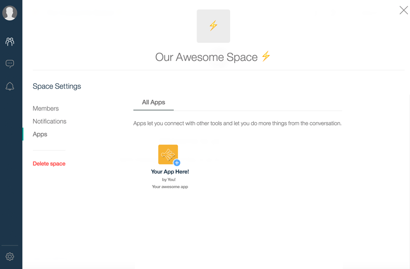
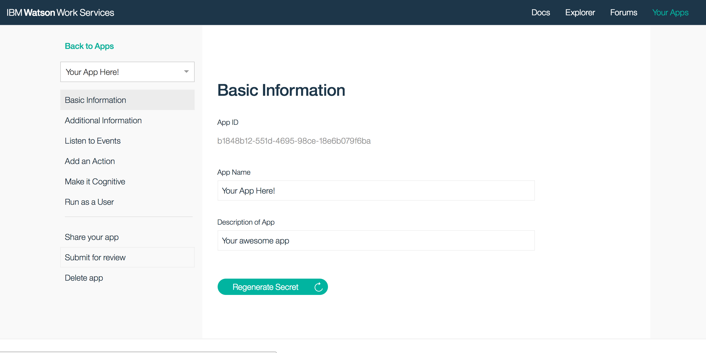
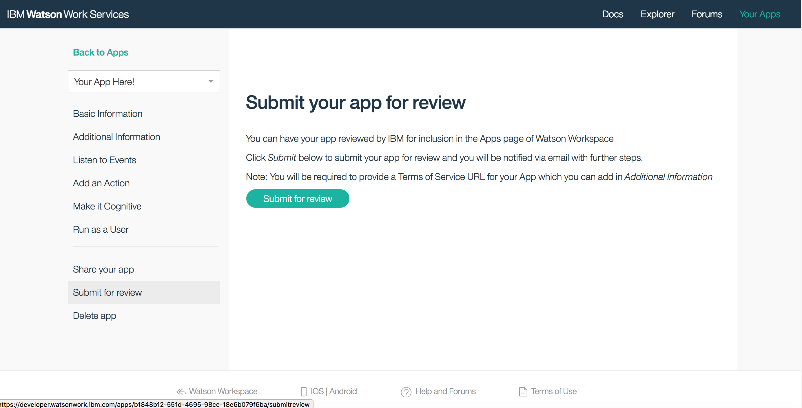
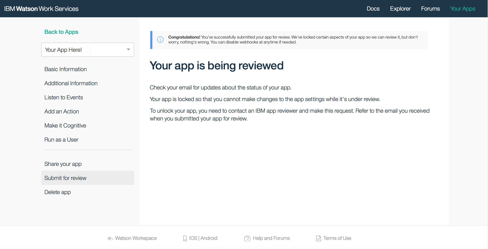

## Publish in the catalog

Once you’ve built your app, and tested it out with a few colleagues, you may want to get your app published in the catalog. 
When you do that, your app will be exposed to users of applications based on Work Services via their presentation of the Catalog. For example, IBM Watson Workspace presents the catalog in the Apps section of a space settings page. Note that in some cases involving paid organizations, administrators may still block your app from being displayed as they can pick and choose which apps are utilized.

## The publishing process

For your app to get into the catalog, you have to first submit it for review by IBM. You can do this by going to [Your Apps](https://developer.watsonwork.ibm.com/apps), then selecting your app 

Then you click *Submit for review*.

Once you submit it, our review team will need to go through the review process, and they will work with you giving you feedback 
so that your app can get approved. The review process makes use of the [App review checklist](./V1_AppReviewChecklist.md), please use this checklist to prepare 
your app for review. You will be contacted via email to provide the outlined items.

Once it’s approved then it will appear in the catalog.
