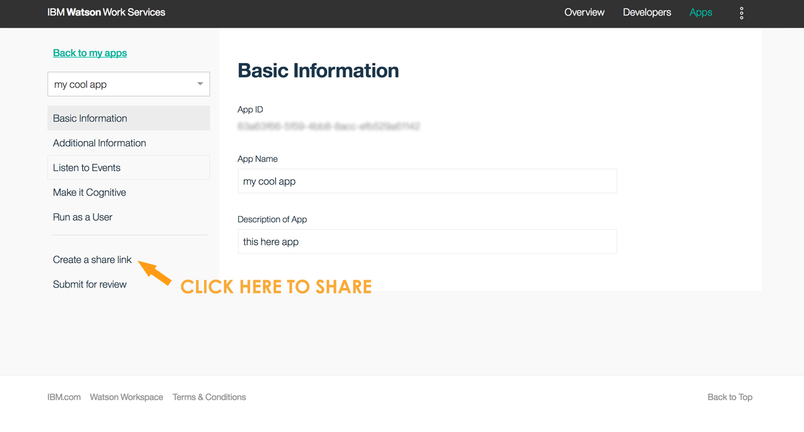
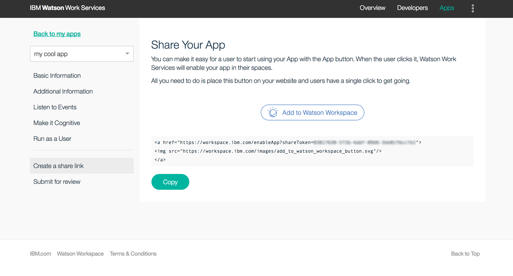
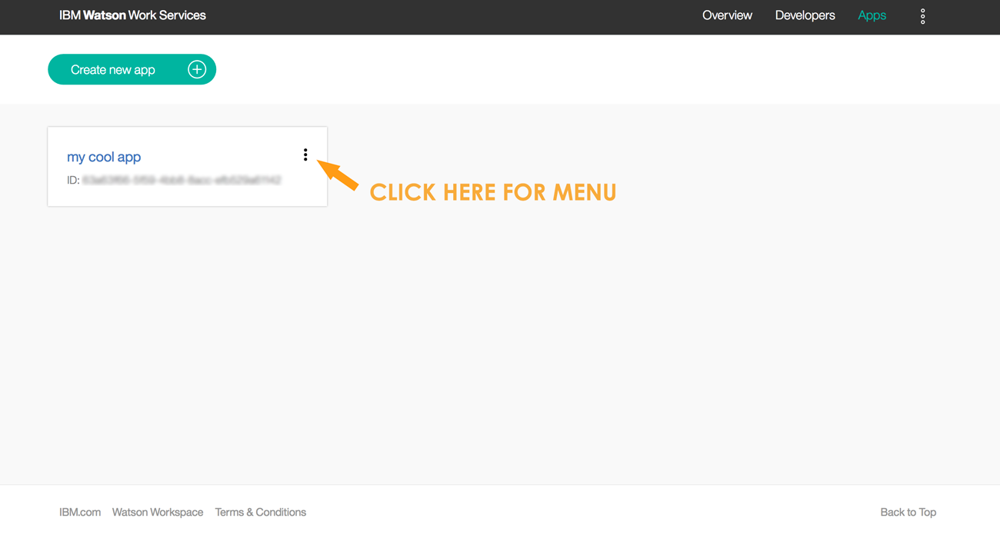
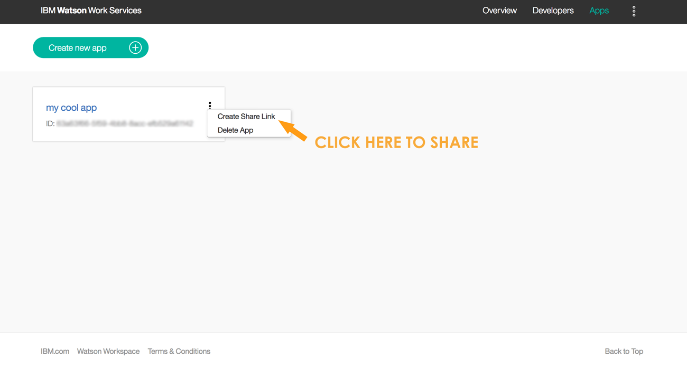
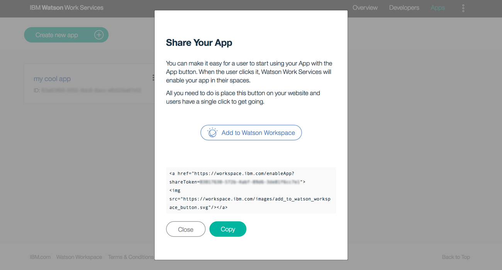
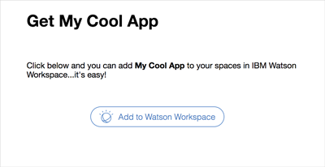
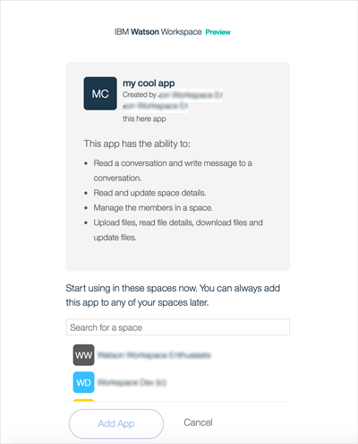
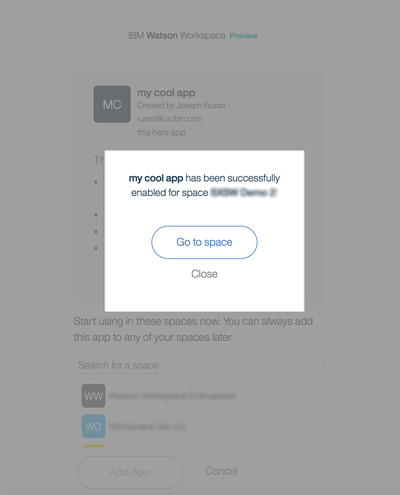

## Share an App

Once you get an app working and you want to share it with others so they can start using it and give you feedback, you can easily do this with the share button. We will generate an HTML snippet you can add to a page or email. You’ll get a URL and also, with the snippet, an image button.

In order to start sharing, you first have to build an app - go to the Apps page to do that, [Register your App](https://developer.watsonwork.ibm.com/apps).

Once you register an app, you will see this:

Click on the Create share link and...

Now you have enabled sharing for your app. You should just copy the HTML snippet, and paste this into an HTML page, where your users will see the Watson Workspace share button. Any user clicking on that Button will be able to add your app to spaces they choose, ( see the user experience flow further below).

You could also just copy the URL for the anchor tag and give that to users to click (like pasting it as a link into an email). Any user clicking on that URL will be able to add your app to spaces they choose.

Another way to share your app is through a menu off of the My Apps page. Click on your app from the My Apps page and you will see something like this:

Click on the menu icon and then click on the **Create share link**:

And you will see:

Don’t worry when you do it for real, the ID won’t be blurry!

Now here’s an example of a **User Experience** for sharing. If you take that HTML snippet, you can create a page that looks something like this:

And they can click to **Add to Watson Workspace**. If they are not already logged into Workspace, they will be guided to do so.
Then they will see more details about your app, what it can do and your name and email address. They can
select a space to add it to, this is scrollable and lets the user use type-ahead to find a space for this app.

Once they select a space they can click Add App and bingo, it gets added!

Start building and sharing apps now, go to [Register your App](https://developer.watsonwork.ibm.com/apps).
