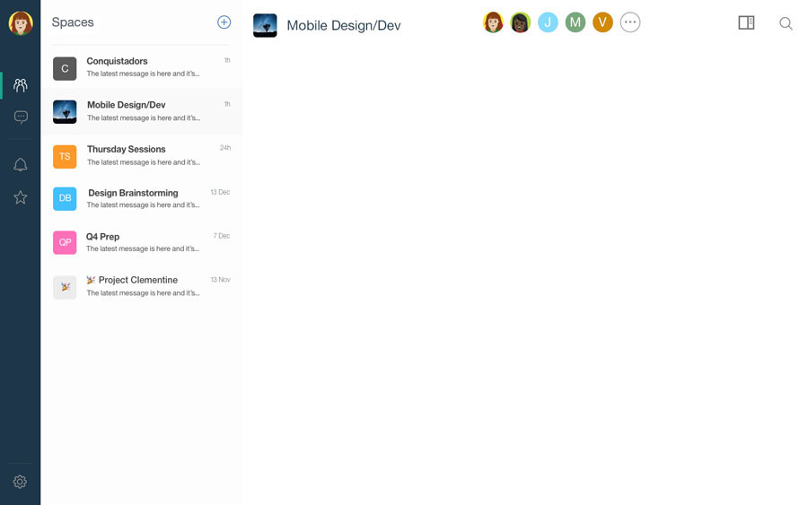
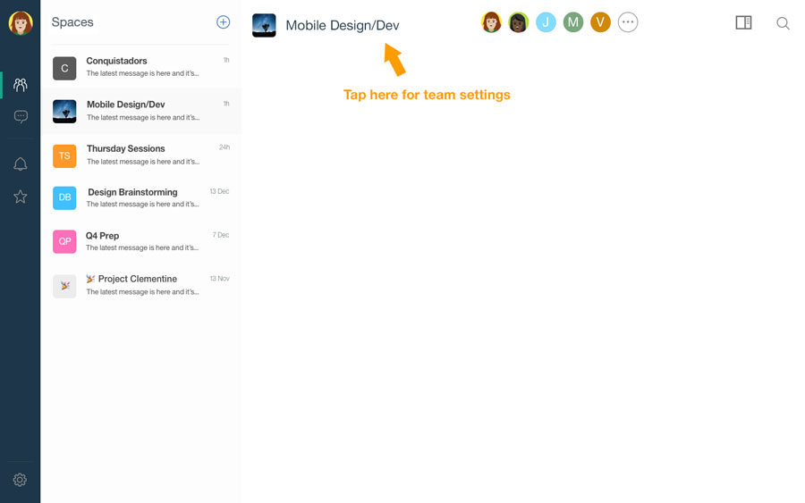
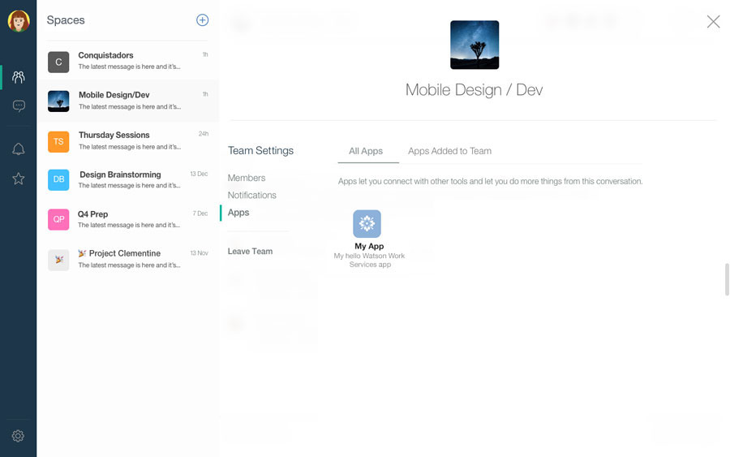

## Authorize an App

After you register an app in Watson Work Services, it can either act on behalf of any Watson Work Services user (via OAuth2) and thus do what such user has authorized the app to do and/or it can also act on its own identity.  Acting on its own identity requires that the app first be added to a space by the owner of the app implicitly authorizing the app to perform three capabilities:

1. It can post messages into that space.
2. It can listent to events taking place in that space via a webhook.
3. It can query and change data about that space via GraphQL requests.

Here’s how to add an app to a space so it can post messages into the conversation:

1. Log in to [Watson Workspace](https://workspace.ibm.com).

2. Select a space where you want to add your app, and click the name to open that space.

3. In the space’s conversation, click the space’s name to access the settings.

4. In the Space Settings, click **Apps**.

5. Select your app and confirm that you want to add it to this space. Done!

