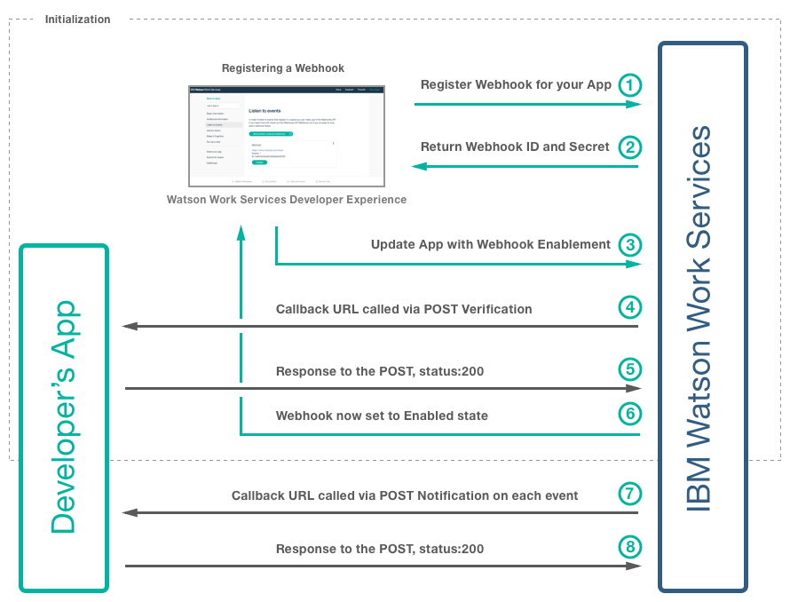
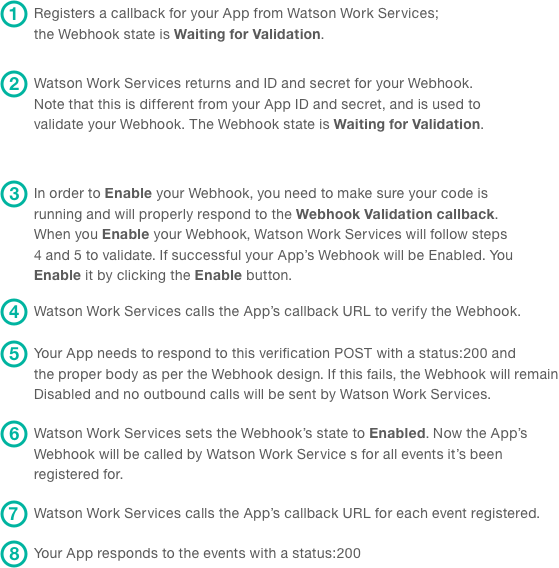

## Listen to events in a space (Outbound Webhooks)

Using Outbound Webhooks, your App can provide an automated response to messages that members post in a space.  For example, you could have an app that listens for a trigger word such as "weather" in the conversation and every time it records this event, it responds with a message in the conversation that displays the current weather.  Basically, your app receives an HTTP POST from Watson Work Services when specific events occur in the space, such as the trigger word "weather", and then automatically responds.  

## Enabling Outbound Webhooks
To enable outbound Webhooks in your App you need to register your callback URL for IBM Watson Work Services.  

A callback occurs in these two situations:
 - Initially, when the callback is enabled  to verify that the URL of the callback is under the control of the person who registered it.  Note that during registration, the URL must be valid and resolve itself as a valid address. Additionally, the HTTPS certificate of the server that processes the URL is verified and stored. (see [Preparing your App to run](../guides/V1_PreparingYourApp.md) to learn how to code the verification function)
 - And then, repeatedly for each event, for which the callback was added.

Each event must be acknowledged as being processed by returning an http status, such as 200, back to Watson Work Services

To register your callback URL follow these steps:
1. Go to **Your Apps** in the top navigation of this site
2. Select an app
3. Choose **Listen to Events** from the App Dashboard.  
4.  Click **Add an outbound webhook**.
5.  Add the callback URL and select one or more events.
6.  Click **Save**.

Available events are:

**message-created**: each time a new message is created in the space

**message-deleted**: each time a message is deleted from the space. 

**message-edited**: each time message content is edited in the space. Please note that the triggering of **message-edited** events takes place due to a change in the data model via Administrator action, End User action or through an API call. Currently only Administrator actions are implemented

**space-members-added**: each time a member is added to the space

**space-members-removed**: each time a member is removed from the space

**space-updated**: each time the space is modified

**space-deleted**: on space deletion

**message-annotation-added**: each time an annotation is added to a message

**message-annotation-edited**: each time an annotation that is bound to a message is modified

**message-annotation-removed**: each time an annotation is removed from a message

**reaction_added**: each time a reaction is added to a message

**reaction_removed**: each time a reaction is removed from a message

**message_edited**: each time a message is updated (EVENT is EXPERIMENTAL)

_Since this is an_ `EXPERIMENTAL` _capability, complete information can be found in our github repo, [see Coming Next section](../get-started/coming-next) for more info_.

Details about event notification requests are described in the [Webhooks API Reference](../references/V1_OutboundCallback.yml).

  
  
<strong>Note:</strong> It's important that your App carries out the proper handshake sequence. To learn more, read <a href="https://developer.watsonwork.ibm.com/docs/apps/prepare-your-app-to-run">Preparing your App to run</a>.

