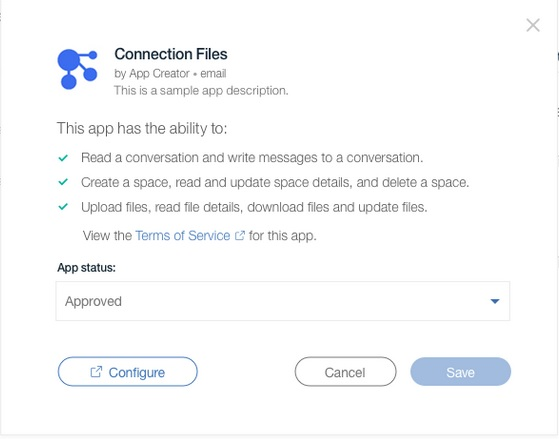

## Handling Client Actions

Watson Work Services allows your App to provide for actions issued from a Watson Work Services client (for example, Watson Workspace). Here your App will be invoked directly from the client app and can provide a user experience to guide a user through the fulfillment of that action. This is accomplished in one of two ways, using Commands or Client Action Handlers.

### Commands

Refer to [Commands](../guides/slash_commands.md) for details.

### Client Action Handlers

Client Action Handlers allow your App to deliver a user experience to a Watson Work Services 
client. You will need to register a call back URL that the client can invoke for specified actions 
so that the client can recognize and enable your action for users. Once a user invokes your 
action through the client, your App can access context. 

Here’s the flow for client action handlers:

Currently you can register a Client Action Handler to deal with configuration of your App, and 
this supports two configuration use cases. For a user in a space, your App can provide 
configuration called "space configuration". Also, your app can provide configuration for a 
team, so that a team administrator can set the appropriate configuration for your app for their 
entire team, called "team configuration". 

Steps to add an action handler:
1. Go to Your Apps and choose an App.
2. Click Add an Action. 
3. Click Add an action handler.
4. Type the action handler URL.
5. Select the action type that you want. 

Current available action types are:
*team-app-config-requested: Select this type if you want to enable the team configuration. 
*space-app-config-requested: Select this type if you want to enable thea space configuration. 

Note: You can still update the existing configuration URL for your previous App. Go to Add an Action, and change the URL there. 

### Space Configuration 

Invididual users including team members, space owners, and space users can configure the Apps based on their preferences. For example, a scheduling app might need calendar access. Having the user's authorization or credentials is essential for coordinating with third-party services.  

Recognizing user-specific preferences can also enhance your App. For example, the scheduling app can propose better meeting times when user has already entered their preferred times.

If your App enables space configuration, users in a space will see a Configure button.

### Team Configuration 

The team administrators manage the app configuration for the entire team and the configuration can improve the enablment of your App. For example, for a file managment App, the team administraotr can configure the source url of the file service and the the authentication method required.

If your App enables team configuration, team administrators will see a Configure button in App details page from the administration portal. Only the team administrators have access to configure an App for the entire team.  

### App Configuration Callback

The callback must be implemented to provide the user-specific configuration service of an app. The request is triggered when a user clicks on the Configure button of an app. For existing Apps with old configuration URL, refer to [App Configuration Callback](../guides/V1_App_Configuration_Callback.md).

For new Apps, refer to [App Configuration Callback](../guides/App_action_Callback.md)

### Access Configuration Data or Action Context Information

The configuration data is generated via Watson Work Services by Watson Workspace clients when a user triggers the configuration of your app. It contains the needed data for the configuration of the app. 

When a user clicks the Configure button, if it returns `GET <configurationURL>?configurationToken=<configurationToken>`, refer to [Access configuration data](../guides/V1_Access_Configuration_Data.md) for details.  If it returns `actionURL?actionHandlerContextToken=<token>token`, refer to [Get action context information](../guides/get_action_context.md) for details.

